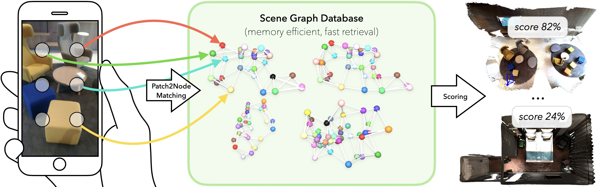
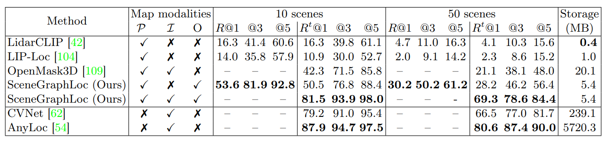

<div align='center'>
<h2 align="center"> SceneGraphLoc:  Cross-Modal Coarse Visual Localization on 3D Scene Graphs </h2>

<a href="https://y9miao.github.io/">Yang Miao</a><sup>1</sup>, 
<a href="https://cvg.ethz.ch/team/Dr-Francis-Engelmann">Francis Engelmann</a><sup>1, 2</sup>, 
<a href="https://cvg.ethz.ch/team/Dr-Olga-Vysotska">Olga Vysotska</a><sup>1</sup>, 
<a href="https://federicotombari.github.io/"> Federico Tombari</a><sup>2, 3</sup>, 
<a href="https://cvg.ethz.ch/team/Prof-Dr-Marc-Pollefeys"> Marc Pollefeys</a><sup>1, 4</sup>, 
<a href="https://cvg.ethz.ch/team/Dr-Daniel-Bela-Barath"> Dániel Béla Baráth</a> <sup>1</sup>

<sup>1</sup>ETH Zurich   <sup>2</sup>Google   <sup>3</sup>TU Munich   <sup>4</sup>Microsoft

SceneGraphLoc solves the novel problem of cross-modal localization of a query image within 3D scene graphs incorporating a mixture of modalities.



</div>

[[Video](https://www.youtube.com/watch?v=_7YPGsMrVcQ)]
<!-- [[Project Webpage](https://sayandebsarkar.com/sgaligner/)]
[[Paper](https://arxiv.org/abs/2304.14880)] -->


## News :newspaper:

<!-- * **14. July 2023** : SGAligner accepted to ICCV 2023. :fire:
* **1. May 2023**: [SGAligner preprint](https://arxiv.org/abs/2304.14880v1) released on arXiv. -->
* **16. Sep 2024**: Instructions updated and pretrained model uploaded.
* **8. July 2024**: Code was made public.
* **1. July 2024**: Accepted to ECCV 2024!
* **26. Mar 2024**: Code was uploaded.

## Code Structure :clapper:

```
├── VLSG
│   ├── preprocessing         <- data preprocessing
│   ├── configs               <- configuration definition
│   ├── src
│   │   │── datasets          <- dataloader for 3RScan and Scannet data
│   │   │── engine            <- trainer classes
│   │   │── models            <- definition of models and losses
│   │   │── room_retrieval    <- inference for scene graph retrieval
│   │   │── trainers          <- train + validation loop 
│   ├── scripts               <- implementation scripts 
│   │── utils                 <- util functions
│   │── README.md                    
```

### Dependencies :memo:

The project has been tested on Ubuntu 20.04.
The main dependencies of the project are the following:
```yaml
python: 3.8.15
cuda: 11.6
```
You can set up an environment as follows :
```bash
git clone https://github.com/y9miao/VLSG.git
cd VLSG

conda create -n "VLSG" python=3.8.15
conda activate VLSG
pip install -r requirement.txt
```
Other dependences:
```bash
conda activate VLSG
pip install -r other_deps.txt

cd thrid_party/Point-NN
pip install pointnet2_ops_lib/.
```

## Dataset Generation :hammer:
### Download Dataset - 3RScan + 3DSSG
Download [3RScan](https://github.com/WaldJohannaU/3RScan) and [3DSSG](https://3dssg.github.io/). Move all files of 3DSSG to a new ``3RScan/files/`` directory within Scan3R. The additional meta files are available [here](https://drive.google.com/file/d/1abvycfnwZFBBqYuZN5WFJ80JAB1GwWPN/view?usp=sharing). Download the additional meta files and move them to ``3RScan/files/``.
The structure should be:

```
├── 3RScan
│   ├── files                 <- all 3RScan and 3DSSG meta files and annotations
│   │   ├──Features2D         <- Pre-computed patches features of query images
│   │   ├──Features3D         <- Visual features of 3D objects
│   │   ├──orig               <- Scene Graph Data
│   │   ├──patch_anno         <- Ground truth patch-object annotation of query images
│   │   meta files
│   ├── scenes                <- scans
```

> To generate ``labels.instances.align.annotated.v2.ply`` for each 3RScan scan, please refer to the repo from 
[here](``https://github.com/ShunChengWu/3DSSG/blob/master/data_processing/transform_ply.py``).


### Dataset Pre-process :hammer:
After installing the dependencies, we download and pre-process the datasets. 


First, we pre-process the scene graph information provided in the 3RScan annotation. The relevant code can be found in the ``data-preprocessing/`` directory.   
Don't forget to set the env variables "VLSG_SPACE" as the repository path,  set "Data_ROOT_DIR" as the path to "3RScan" dataset and set "CONDA_BIN" to accordingly in the bash script.

```bash
bash scripts/preprocess/scan3r_data_preprocess.sh
```
The result processed data will be save to "{Data_ROOT_DIR}/files/orig".
<!-- > __Note__ To adhere to our evaluation procedure, please do not change the seed value in the files in ``configs/`` directory.  -->

### Generating Ground Truth Patch-Object Annotastion
To generate ground truth annotation, use : 
```bash
bash scripts/gt_annotations/scan3r_gt_annotations.sh
```
This will create a pixel-wise and patch-level ground truth annotations for each query image.  

### Patch-Level Features Pre-compute
In order to speed up training, we pre-compute the patch-level features with 
      [Dino v2](https://dinov2.metademolab.com/). 
To generate the features, use : 
```bash
bash scripts/features2D/scan3r_dinov2.sh
```
This will create patch-level features for query images and save in "{Data_ROOT_DIR}/Features2D/DinoV2_16_9_scan".  

### Image Crops of 3D Objects
In order to speed up training, we pre-compute the features of multi-view and multi-level image crops of 3D objects, which are used for 3D scene graph embeddings of image modality.
To generate the features, use : 
```bash
bash scripts/features3D/scan3r_sg_image.sh
```
This will create 10-view, 3-level features of image crops of 3D objects and save in "{Data_ROOT_DIR}/Features3D/obj_dinov2_top10_l3". 

## Training :bullettrain_side:
To train SceneGraphLoc on 3RScan dataset generated from [here](#dataset-generation-hammer), you can use :

```bash
bash scripts/train_val/train.sh
```

## Evaluation :vertical_traffic_light:
To evaluate SceneGraphLoc on 3RScan dataset in the task of scene graph retrieval, you can use:

```bash
bash scripts/train_val/inference.sh
```
The pretrained model is available [here](https://drive.google.com/file/d/1IAs3S30wmtZnLt0M4QnLRj-lYPULA3hm/view?usp=sharing).  
Don't forget to set the env variable "ROOM_RETRIEVAL_OUT_DIR" to the parent dir of the pretrained model. 

## Benchmark :chart_with_upwards_trend:
### Coarse Visual Localization on 3D Scene Graphs


## BibTeX :pray:
```
@misc{miao2024scenegraphloc,
      title={SceneGraphLoc: Cross-Modal Coarse Visual Localization on 3D Scene Graphs}, 
      author={Yang Miao and Francis Engelmann and Olga Vysotska and Federico Tombari and Marc Pollefeys and Dániel Béla Baráth},
      year={2024},
      eprint={2404.00469},
      archivePrefix={arXiv},
      primaryClass={cs.CV}
}
 ```

## Acknowledgments :recycle:
In this project we use (parts of) the official implementations of the following works and thank the respective authors for sharing the code of their methods: 
- [SGAligner](https://github.com/sayands/sgaligner) 
- [OpenMask3D](https://openmask3d.github.io/)
- [Lip-Loc](https://liploc.shubodhs.ai/) 
- [Lidar-Clip](https://github.com/atonderski/lidarclip)
- [AnyLoc](https://github.com/AnyLoc/AnyLoc)
- [CVNet](https://github.com/sungonce/CVNet)
- [SceneGraphFusion](https://github.com/ShunChengWu/3DSSG)

